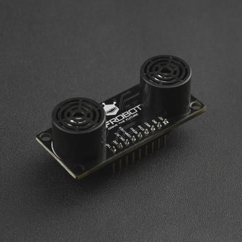

# DFRobot_LoRaWAN

DFRobot_LoRaWAN is an Arduino communication library developed for the DFR1195 node, enabling the node to communicate with the gateway using the LoRaWAN 1.0.3 protocol stack. It also integrates the DFRobot_LoRaRadio library, allowing for LoRa point-to-point communication between nodes.

Product images



## Product Link (Link to DFRobot store)

    SKU: DFR1195

## Table of Contents

* [Summary](#summary)
* [Installation](#installation)
* [DFRobot_LoRaWAN Methods](#DFRobot_LoRaWAN methods)
* [DFRobot_LoRaRadio Methods](#DFRobot_LoRaRadio Methods)
* [Compatibility](#compatibility)
* [History](#history)
* [Credits](#credits)

## Summary

Using this library allows end nodes to join a LoRaWAN network via OTAA or ABP, communicate with the gateway using confirmed or unconfirmed packets, and enables multi-node communication in LoRaRadio mode. Both LoRaWAN and LoRaRadio communication modes support low power consumption (µA).

## Installation

To use this library, first download the library file, paste it into the \Arduino\libraries directory, then open the examples folder and run the demo in the folder.

## DFRobot_LoRaWAN Methods

```C++
    /**
     * @fn init
     * @brief LoRaWAN node initialization with specified parameters.
     * @param dataRate Node communication data rate
     * @param txEirp Equivalent Isotropically Radiated Power(dBm)
     * @param adr Whether the node has the adaptive data rate feature enabled, default is 		  disabled
     * @param dutyCycle Whether duty cycle transmission limitation is enabled, which can 		 be LORAWAN_DUTYCYCLE_ON or LORAWAN_DUTYCYCLE_OFF, with LORAWAN_DUTYCYCLE_OFF 			being the default.
     * @n LORAWAN_DUTYCYCLE_ON Enable duty cycle transmission limitation
     * @n LORAWAN_DUTYCYCLE_OFF Disable duty cycle transmission limitation
     * @return Whether the node initialization was successful
     * @retval true Initialization successful
     * @retval false Initialization failed
     */
    bool init(int8_t dataRate, int8_t txEirp, bool adr = false, bool dutyCycle = LORAWAN_DUTYCYCLE_OFF);

    /**
     * @fn join
     * @brief LoRaWAN node performs the network join operation and sets a user-defined 			join callback function.
     * @param callback User-defined join callback function, of type joinCallback
     * @return Whether the node actually performed the join operation
     * @retval 1 Actually performed the join operation
     * @retval 0 Actually did not perform the join operation
     */
    int join(joinCallback callback);

    /**
     * @fn isNetworkJoined
     * @brief Determine whether the node has joined the LoRaWAN network.
     * @param None
     * @return Whether the node has joined the LoRaWAN network
     * @retval true Already joined the network
     * @retval false Not yet joined the network
     */
    bool isNetworkJoined();

    /**
     * @fn getNetID
     * @brief Get the node's current network identifier, used to distinguish between 			different networks within the same region.
     * @param None
     * @return Current network identifier, composed of 6 hexadecimal numbers
     */
    uint32_t getNetID();

    /**
     * @fn getDevAddr
     * @brief Get the node device address.
     * @param None
     * @return Node device address, composed of 8 hexadecimal numbers
     */
    uint32_t getDevAddr();

    /**
     * @fn getDataRate
     * @brief Get the node's current communication data rate.
     * @param None
     * @return Node's current communication data rate
     */
    uint8_t getDataRate();

    /**
     * @fn getTxEirp
     * @brief Get the node's equivalent isotropically radiated power(dBm)
     * @param None
     * @return Equivalent isotropically radiated power(dBm)
     */
    uint8_t getTxEirp();

    /**
     * @fn getNwkSKey
     * @brief Get the node's LoRaWAN network layer encryption key.
     * @param None
     * @return Network layer encryption key, composed of 32 hexadecimal numbers
     */
    uint8_t* getNwkSKey();

    /**
     * @fn getAppSKey
     * @brief Get the node's LoRaWAN application layer encryption key.
     * @param None
     * @return Application layer encryption key, composed of 32 hexadecimal numbers
     */
    uint8_t* getAppSKey();

    /**
     * @fn getLastUplinkCounter
     * @brief Get the node's latest (previous) uplink frame counter.
     * @param None
     * @return Uplink frame counter
     */
    uint32_t getLastUplinkCounter();

    /**
     * @fn getLastDownCounter
     * @brief Get the gateway's latest (previous) downlink frame counter.
     * @param None
     * @return Downlink frame counter
     */
    uint32_t getLastDownCounter();

    /**
     * @fn setSleepMode
     * @brief Set the MCU's operating mode.
     * @param mcusleepmode MCU operating mode, which can be either MCU_ACTIVE or 				MCU_DEEP_SLEEP
     * @n MCU_ACTIVE Normal mode
     * @n MCU_DEEP_SLEEP Low power mode, in this mode the node enters sleep after the 			timer starts, wakes up after the set timer duration, and executes the timer 			callback function
     * @return None
     */
    void setSleepMode(eMcuSleepMode_t mcusleepmode);

    /**
     * @fn sleepMs
     * @brief Set the MCU to immediately enter sleep for a specified duration.
     * @param timesleep Node sleep duration(ms)
     * @return None
     */
    void sleepMs(uint32_t timesleep);

    /**
     * @fn setRxHander
     * @brief Set the user-defined callback function for when the node receives data.
     * @param callback User-defined data reception callback function, of type rxHandler
     * @return Set result
     * @retval true Set successful
     * @retval false Set failed, please check if callback is NULL
     */
    bool setRxHander(rxHander callback);

    /**
     * @fn setTxHander
     * @brief Set the user-defined callback function for when the node sends data.
     * @param callback User-defined data transmission callback function, of type 				txHandler
     * @return Set result
     * @retval true Set successful
     * @retval false Set failed, please check if callback is NULL
     */
    bool setTxHander(txHander callback);
  
    /**
     * @fn sendConfirmedPacket
     * @brief Node sends data to the gateway in confirmed packet mode.
     * @param port Node communication port with the gateway
     * @param buffer Data to be sent by the node
     * @param size Size of the data to be sent by the node
     * @return Whether the node's request to send confirmed packet data was successful
     * @retval true Send successful
     * @retval false Send failed
     */
    bool sendConfirmedPacket(uint8_t port, void *buffer, uint8_t size);

    /**
     * @fn sendUnconfirmedPacket
     * @brief Node sends data to the gateway in unconfirmed packet mode.
     * @param port Node communication port with the gateway
     * @param buffer Data to be sent by the node
     * @param size Size of the data to be sent by the node
     * @return Whether the node's request to send unconfirmed packet data was successful
     * @retval true Send successful
     * @retval false Send failed
     */
    bool sendUnconfirmedPacket(uint8_t port, void *buffer, uint8_t size);
  
    /**
     * @fn TimerInit
     * @brief Node timer initialization function; in low power mode, the timer callback 		function will execute after the MCU wakes up.
     * @param obj Timer object
     * @param callback Timer callback function
     * @return None
     */
    void TimerInit(TimerEvent_t *obj, void (*callback)(void));

    /**
     * @fn TimerValue
     * @brief Node timer timeout setting function; in low power mode, the value parameter 		  represents the MCU's sleep duration.
     * @param obj Timer object
     * @param value Timer timeout duration, which in sleep mode corresponds to the node's 		  sleep duration(ms)
     * @return None
     */
    void TimerValue(TimerEvent_t *obj, uint32_t value);

    /**
     * @fn TimerStart
     * @brief Node timer start function; in low power mode, the MCU immediately enters 			sleep after calling this function.
     * @param obj Timer object
     * @return None
     */
    void TimerStart(TimerEvent_t *obj);

    /**
     * @fn attachInterrupt
     * @brief Node button interrupt callback binding function.
     * @details In low power mode, pressing the button can wake the MCU from sleep mode 		and execute the user-defined button interrupt callback.
     * @param pin Button pin number, which must be connected to an interrupt capable of 		waking the MCU
     * @param cb User-defined button interrupt callback function, of type buttonCallback
     * @param mode Trigger mode, which can be LOW or HIGH
     * @n LOW Trigger on LOW level
     * @n HIGH Trigger on HIGH level
     * @return None
     */
    void attachInterrupt(uint8_t pin, buttonCallback cb, int mode);
```

## DFRobot_LoRaRadio Methods

```C++
    /**
     * @fn init
     * @brief Initializes the LoRa radio module.
     * @return None
     */
    void init();

    /**
     * @fn setTxEirp
     * @brief Sets the transmission power of the LoRa radio module.
     * @param txeirp Equivalent Isotropically Radiated Power(dBm)
     * @return None
     */
    void setTxEirp(int8_t txeirp);

    /**
     * @fn setSpreadingFactor
     * @brief Set the spreading factor of the radio.
     * @param SF The spreading factor to set (unsigned 8-bit integer).
     * @return None
     */
    void setSpreadingFactor(uint8_t SF);

    /**
     * @fn setBandwidth
     * @brief Set the bandwidth of the radio.
     * @param bandwidth The bandwidth to set (enumeration type eBandwidths_t).
     * @return None
     */
    void setBandwidth(eBandwidths_t bandwidth);

    /**
     * @fn setSync
     * @brief Sets the synchronization word of the LoRa radio module.
     * @param sync The synchronization word.
     * @return None
     */
    void setSync(uint16_t sync);

    /**
     * @fn setFrequency
     * @brief Sets the frequency of the LoRa radio module.
     * @param freq The frequency, in Hz.
     * @return None
     */
    void setFrequency(uint32_t freq);

    /**
     * @fn setTxCallback
     * @brief Sets the callback function for when data transmission is completed.
     * @param cb The callback function.
     * @return None
     */
    void setTxCallback(onTxDone cb);

    /**
     * @fn sendData
     * @brief Sends data using the LoRa radio module.
     * @param data Pointer to the data to be sent.
     * @param size The length of the data, in bytes.
     * @return None
     */
    void sendData(const void *data, uint8_t size);

    /**
     * @fn setRxCallBack
     * @brief Sets the callback function for when data reception is completed.
     * @param cb The callback function.
     * @return None
     */
    void setRxCallBack(onRxDone cb);

    /**
     * @fn setRxTimeOutCallback
     * @brief Sets the callback function for when data reception times out.
     * @param cb The callback
     * @return None
     */
     void setRxTimeOutCallback(onRxTimeout cb);

     /**
      * @fn setRxErrorCallback
      * @brief Sets the callback function for when data reception encounters an error.
      * @param cb The callback function.
      * @return None
      */
     void setRxErrorCallback(onRxError cb);

     /**
      * @fn startRx
      * @brief Starts receiving data using the LoRa radio module.
      * @param timeout The timeout, in milliseconds.
      * @return None
      */
     void startRx(uint32_t timeout);

     /**
      * @fn setCadCallback
      * @brief Sets the callback function for when channel activity detection is 				 completed.
      * @param cb The callback function.
      * @return None
      */
     void setCadCallback(OnCadDone cb);

     /**
      * @fn startCad
      * @brief Starts channel activity detection using the LoRa radio module.
      * @param dataRate The data rate, in bits per second.
      * @param cadSymbolNum the number of symbols to be used for channel activity 				 detection operation.
      * @return None
      */
     void startCad(uint8_t dataRate, RadioLoRaCadSymbols_t cadSymbolNum);

     /**
      * @fn radioDeepSleep
      * @brief Puts the LoRa radio module and MCU in deep sleep mode.
      * @return None
      */
     void radioDeepSleep();
   
     /**
      * @fn setEncryptKey
      * @brief Set the encryption key for the radio.
      * @param key Pointer to the encryption key (unsigned 8-bit integer array).
      * @return None
      */
     void setEncryptKey(const uint8_t *key);

     /**
      * @fn dumpRegisters
      * @brief Dump the registers of the radio.
      * @n This function prints the current values of all the registers of the radio to 		 the output (serial monitor).
      * @return None
      */
     void dumpRegisters();

```

## Compatibility

| MCU         | Work Well | Work Wrong | Untested | Remarks |
| ----------- | :-------: | :--------: | :------: | ------- |
| Arduino uno |          |            |          |         |
| Mega2560    |          |            |          |         |
| Leonardo    |          |            |          |         |
| ESP32       |    √    |            |          |         |
| micro:bit   |          |            |          |         |

## History

- 2025/04/11 - Version 1.0.0 released.

## Credits

Written by Martin(Martin@dfrobot.com), 2025. (Welcome to our [website](https://www.dfrobot.com/))
